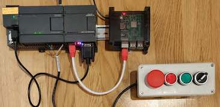

http-plc4x
----------------

### Preparations
This example shows how to connect to a Siemens S7 PLC through Ethernet (e.g. using a CP 243-1), and expose its functionality as JSON webservices.
 
Depending on what model you are using, a different connection string will be needed, and at the very least you will need 
to correct the IP address used in the example code, in the `PlcServer` class:

```
    static final String connectionString = "s7://192.168.1.222/0/2?controller-type=S7_300";
```
`s7` refers to the Siemens S7 protocol. The IP Address is that of your 'Communication Processor'. The two next components
are the Rack and Slot address of your siemens PLC (this part will be different for other PLC types). This will depend on
the type and configuration of your PLC, but some common values are:
- S7 200: Rack 0, Slot 0
- S7 300: Rack 0, Slot 0
- S7 400: Depending on the configuration
- S7 1200: Rack 0, Slot 0 or Slot 1
- S7 1500: Rack 0, Slot 0 or Slot 1

Refer to the [PLC4X documentation](http://plc4x.apache.org/plc4j/plc4j-protocols/developers/implementing-drivers.html) for 
more information about connection strings. The [Sharp7 project page](http://snap7.sourceforge.net/sharp7.html) has some
good information about the settings for various types of S7 CPUs.

The example assumes that a 'Control Box', containing 4 buttons, is connected to the inputs I1.0 through I1.3, and that a 
stack of 3 status lights will be connected to outputs Q0.0 through Q0.2, but it will work without either: If no switches 
are connected to the inputs, their state will always be "low". If no lights are connected to the outut, the state of the
lights can still be seen on the S7 PLC's diagnostic lights.



### Working with the RIoT Framework
